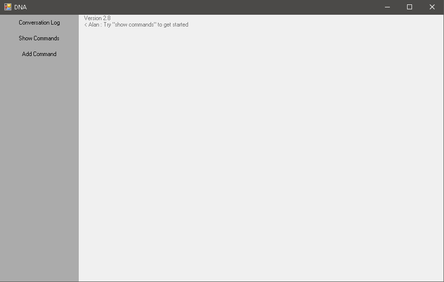

# DNA
DNA or Dynamic Narration Assistant is a user programmable application that allows for the user to dictate commands to control the system, for Example, DNA can navigate windows by say select [window name], it can also be programmed to open application when the user gives it a specific command and the path to the executable or file. The programmes dictionary is completely dependent on what the user decides it to be.

# DNA Windows
<h2> Conversation window </h2>

  

<h2> DNA command listing window </h2>

  

<h2> Edit command window </h2>

  

<h2> New command window </h2>

  

